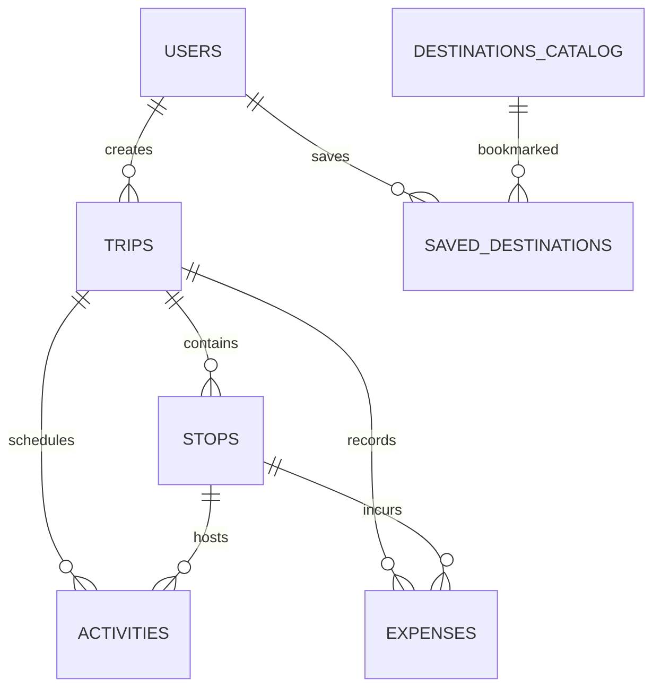

# GlobeTrotter — Empowering Personalized Travel Planning

> **Odoo Hackathon Project**  
> An end-to-end multi-city travel planning platform built with a relational SQLite database, responsive modern UI/UX, interactive map routing, automated budget analytics, and public sharing.

---

## 🌟 Key Features & Problem Statement Coverage

GlobeTrotter satisfies all 13 core screens and requirements defined in the hackathon brief:

| # | Feature / Screen | Capabilities Implemented |
|---|---|---|
| 1 | **Login / Signup** | Email & password auth, input validation, role-based profiles (`traveler`, `admin`), persona quick-switcher banner for hackathon judges. |
| 2 | **Dashboard / Home** | Personalized greeting, quick statistics (trips, stops, activities, budgets), active trip cards, and recommended destination discovery. |
| 3 | **Create Trip Screen** | Multi-city trip initiation form with start/end dates, budget allocation, currency selector, and curated cover photo gallery. |
| 4 | **My Trips (Trip List)** | Filter by status (`Upcoming`, `Completed`, `Draft`), search, trip card summaries with city pills, budget progress meters, clone & delete actions. |
| 5 | **Itinerary Builder** | Interactive stop-by-stop constructor, add/delete/reorder city stops, schedule activities, set accommodation costs, and calculate durations. |
| 6 | **Itinerary View** | Day-by-day and city-grouped structured layouts, activity time/cost tags, status toggles (`Planned` ➔ `Booked` ➔ `Completed`), and PDF export. |
| 7 | **City Search & Discovery** | Multi-facet filtering by Continent, Region, Cost Index (`$` to `$$$$`), popularity ratings, and 1-click *"Add to Active Trip"*. |
| 8 | **Activity Search & Catalog** | Browse 50+ curated experiences categorized by *Sightseeing*, *Food & Dining*, *Adventure*, *Culture*, *Relaxation*, with 1-click scheduling. |
| 9 | **Budget & Cost Breakdown** | Automated financial tracking, target vs. spent progress bar with overbudget alerts, **Category Doughnut Chart**, **Daily Spending Bar Chart**, and real-time expense logger. |
| 10 | **Trip Calendar & Timeline** | Multi-day agenda schedule, hourly slots, and vertical journey progression timeline. |
| 11 | **Shared / Public Itinerary** | Unique public share slugs (`/api/public/trips/:slug`), read-only view, **1-Click Copy / Fork Trip** to import into user's account, QR code generator, and Twitter/WhatsApp share. |
| 12 | **User Profile & Settings** | Edit bio, avatar, currency preference, manage saved wishlist destinations, export data to JSON, and reset database to demo state. |
| 13 | **Admin & Analytics Dashboard** | Platform usage metrics, top visited cities, category breakdown, table schema inspector, and **Live SQL Query Inspector** to evaluate relational integrity. |

---

## 🏗️ Architecture & Relational Database Design

GlobeTrotter demonstrates proper relational database engineering using SQLite with enforced foreign key integrity (`PRAGMA foreign_keys = ON;`).



### Relational Tables Overview
1. **`users`**: Traveler credentials, avatars, home currency, language preferences, and administrative roles.
2. **`trips`**: Multi-city journey metadata, budget allocations, start/end dates, cover photos, and unique public share slugs (`ON DELETE CASCADE`).
3. **`stops`**: City waypoints in a trip with arrival/departure dates, order indices, accommodation costs, coordinates, and notes (`REFERENCES trips(id)`).
4. **`activities`**: Scheduled events with categories, start times, durations, costs, locations, and status flags (`REFERENCES stops(id)` and `trips(id)`).
5. **`expenses`**: Recorded financial transactions categorized by *Transport*, *Accommodation*, *Activities*, *Meals*, and *Misc* (`REFERENCES trips(id)`).
6. **`destinations_catalog`**: Pre-seeded global database of 15 world destinations with cost indices, ratings, and coordinates.
7. **`activities_catalog`**: Pre-seeded collection of curated excursions and tours.
8. **`saved_destinations`**: User destination wishlist (`UNIQUE(user_id, destination_id)`).
9. **`analytics_events`**: Audit log of platform actions for administrative metrics.

---

## 🚀 How to Run the Application

### 1. Start the Server
```bash
python server.py
```
The server will initialize the SQLite database (`globetrotter.db`), seed demo data, and listen at:
👉 **`http://localhost:8000`**

### 2. Run Automated Verification Tests
```bash
python test_app.py
```
Executes comprehensive end-to-end tests validating static assets, user authentication, multi-city trip creation, relational joins, budget calculations, public forking, and the Admin SQL Inspector.

---

## 🔑 Demo Personas for Judges
- **Traveler Persona**: `traveler@odoo.com` (Password: `odoo123`) — Has active trips: *"Grand European Odyssey"* and *"Japan Cherry Blossom & Zen Odyssey"*.
- **Admin Persona**: `admin@odoo.com` (Password: `admin123`) — Access to platform analytics and live SQL database inspector.
- **Guest / New User**: Switchable with one click via the top demo banner bar.
